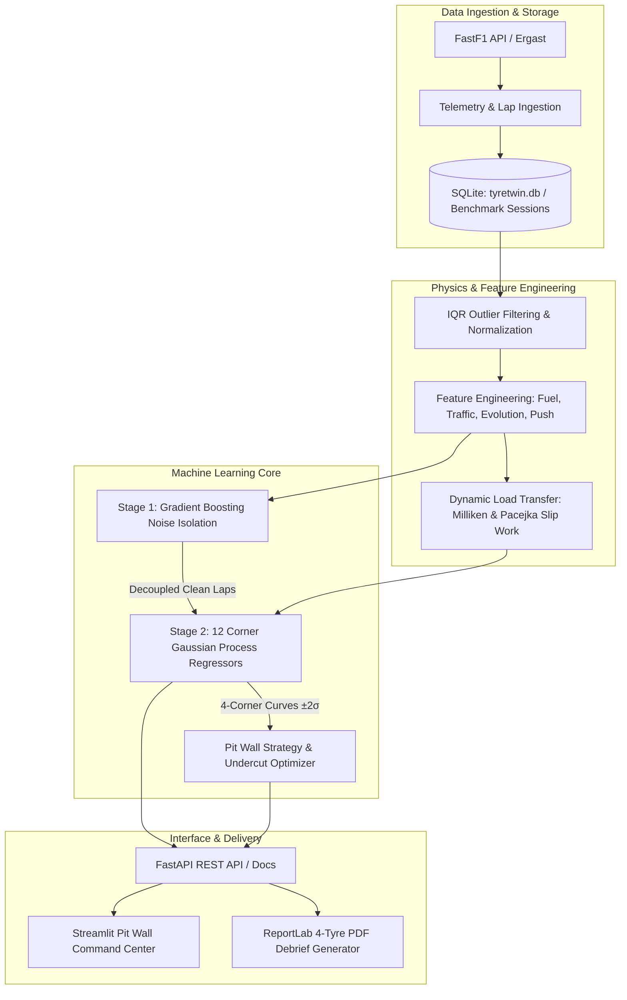

# TyreTwin — Formula 1 Tyre Degradation & Noise Isolation Intelligence Platform

[](https://www.python.org/downloads/)
[](https://fastapi.tiangolo.com)
[](https://streamlit.io)
[](https://www.docker.com)
[](https://opensource.org/licenses/MIT)

**TyreTwin** is a Formula 1 pit wall telemetry intelligence platform designed to decouple external non-tyre noise (fuel burnoff, traffic wakes, track grip evolution, driver aggression, and thermal conditions) from practice session telemetry (FP1, FP2, FP3). It models true mechanical tyre degradation individually across all four wheel corners (Front-Left, Front-Right, Rear-Left, Rear-Right) using multi-corner Gaussian Process regression with Bayesian $\pm 2\sigma$ epistemic uncertainty intervals, providing real-time strategic pit window solutions and automated engineering debrief reports.

---

## Table of Contents

- [The Motorsport Problem](#the-motorsport-problem)
- [System Architecture & Data Pipeline](#system-architecture--data-pipeline)
- [Four-Corner Telemetry & Physics Modeling](#four-corner-telemetry--physics-modeling)
- [Machine Learning Engine](#machine-learning-engine)
- [Interactive Dashboard Features](#interactive-dashboard-features)
- [Four-Phase Engineering Debrief & PDF Report](#four-phase-engineering-debrief--pdf-report)
- [Recent System Enhancements](#recent-system-enhancements)
- [Repository Structure](#repository-structure)
- [Quickstart Guide](#quickstart-guide)
- [Docker Deployment](#docker-deployment)
- [API Endpoints Reference](#api-endpoints-reference)
- [Automated Testing](#automated-testing)
- [Scientific & Engineering References](#scientific--engineering-references)
- [Tech Stack](#tech-stack)

---

## The Motorsport Problem

In Formula 1 practice and race sessions, raw observed lap times do not directly reflect actual tyre wear due to compounding external noise factors:

$$\text{Observed Lap Time} = \text{True Tyre Performance} + \text{External Noise}$$

Where **External Noise** consists of:
- **Fuel Mass Burnoff**: Starting ~45-105kg ($10\text{ kg} \approx 0.30\text{s}$ lap penalty delta).
- **Track Grip Evolution**: Rubbering-in curve ($\frac{t}{T_{\text{total}}}$) recovering up to $0.45\text{s}$ over a session.
- **Traffic & Dirty Air Wake**: Aerodynamic downforce disruption and micro-sector speed loss adding $+0.65\text{s}$ or more.
- **Driver Push Aggression**: Throttle application severity and brake lockup variance.
- **Thermal Conditions**: Track and ambient temperature offsets from Pirelli's optimal compound operating windows.

Without decoupling these factors, pit wall engineers risk mistaking fuel burnoff pace gains for tyre longevity, or traffic delays for premature tyre degradation.

---

## System Architecture & Data Pipeline

TyreTwin follows an end-to-end multi-tier architecture spanning ingestion, physical modeling, machine learning inference, and pit wall visualization:



---

## Four-Corner Telemetry & Physics Modeling

Rather than treating the vehicle as a single lumped mass, TyreTwin models the distinct mechanical and thermodynamic load on each of the four wheel corners:

- **FL (Front-Left)**: Dictates high-speed lateral outside shear work in clockwise sweeps (Copse, Becketts, 130R).
- **FR (Front-Right)**: Unloaded inside turning scrub, steering lock work, and lateral friction through Esses and kinks.
- **RL (Rear-Left)**: High-torque longitudinal traction acceleration and micro-wheelspin out of slow apexes.
- **RR (Rear-Right)**: Exit kerb strike vertical accelerations, differential preload bias, and full-throttle propulsion.

### Mathematical Formulations

1. **Dynamic Lateral & Longitudinal Load Transfer** (*Milliken & Milliken, SAE*):
   $$\Delta F_{z,\text{lat}} = \frac{m \cdot a_y \cdot h}{t_w}, \quad \Delta F_{z,\text{long}} = \frac{m \cdot a_x \cdot h}{L}$$

2. **Frictional Shear Work & Slip Energy** (*Pacejka, 2012*):
   $$W_{\text{friction, corner}} = \int \left( |F_{y,\text{corner}} \cdot v_{\text{slip,lat}}| + |F_{x,\text{corner}} \cdot v_{\text{slip,long}}| \right) dt$$

3. **Thermodynamic Dissipation** (*Salucci et al., SAE 2020*):
   Surface temperatures respond dynamically to sliding friction work, while core temperatures reflect bulk carcass heat transfer and thermal blistering risks.

4. **Critical Limiter Identification**:
   The tyre corner experiencing the highest cumulative friction work reaches the critical 20% rubber safety threshold first, dictating the vehicle's optimal pit window.

---

## Machine Learning Engine

TyreTwin utilizes a two-stage hybrid machine learning pipeline:

### Stage 1: Noise Decoupling Model (Gradient Boosting)
Trained on physics-derived telemetry features to predict non-tyre noise deltas:

$$\widehat{\text{Noise}} = f_{\text{GBR}}(\text{Fuel Mass}, \text{Track Evolution}, \text{Traffic Wake}, \text{Push Aggression}, \text{Thermal Delta})$$
$$\text{Clean Lap Time} = \text{Observed Lap Time} - \widehat{\text{Noise}}$$

### Stage 2: 12 Multi-Corner Gaussian Process Regressors
Twelve distinct Gaussian Process models are trained across all three dry slick compounds (`SOFT`, `MEDIUM`, `HARD`) for every wheel corner (`FL`, `FR`, `RL`, `RR`) using a Matérn $\nu=2.5$ kernel:

$$k(x, x') = \sigma_0^2 \left(1 + \frac{\sqrt{5}r}{\ell} + \frac{5r^2}{3\ell^2}\right) \exp\left(-\frac{\sqrt{5}r}{\ell}\right) + \sigma_{\text{noise}}^2$$
$$\widehat{y}(\text{lap}) \sim \mathcal{N}\left(\mu(\text{lap}), \sigma^2(\text{lap})\right)$$

This delivers smooth, physically grounded degradation curves accompanied by Bayesian $\pm 2\sigma$ epistemic confidence bands (95% uncertainty envelope) for the critical limiting corner.

---

## Interactive Dashboard Features

The Streamlit pit wall interface provides race engineers with multiple synchronized visualization modes:

1. **Four-Corner Car Schematic & Matrix**:
   - Native front and rear axle cards displaying Remaining Rubber %, Wear Rate (%/lap), Forecasted Cliff Lap, Surface & Core Temperatures, Thermodynamic Condition, and Circuit Load Factor.
   - Four-corner asymmetric tyre wear degradation plot with individual traces and critical 20% cliff threshold indicators.
2. **5-Stage Noise Removal Pipeline**:
   - Interactive step-by-step decoupling: (1) Raw Practice Laps -> (2) Traffic Removed -> (3) Flags Filtered -> (4) Fuel Mass Corrected -> (5) Clean Degradation Curve.
   - Includes automatic playback mode and stage-by-stage lap count diagnostics.
3. **Side-by-Side Telemetry Comparison**:
   - Direct visual comparison of raw observed lap times (with outliers) against noise-decoupled clean laps with GP regression ribbons.
4. **Standard Pit Wall Pace Curve**:
   - Operational race strategist chart showing projected pace per corner, limiting tyre confidence envelope, optimal pit window, and cliff lap.
5. **Sidebar Strategy & Undercut Panel**:
   - Live undercut delta calculation, pit loss penalty modeling, and compound crossover matrix.

---

## Four-Phase Engineering Debrief & PDF Report

The platform includes a dedicated Engineering Report module structured into four dedicated analytical phases:

- **Phase 1 (Front-Left)**: High-speed lateral G loading and outside kinetic shear energy.
- **Phase 2 (Front-Right)**: Inside turning steering lock work and understeer scrub thermal buildup.
- **Phase 3 (Rear-Left)**: Longitudinal traction micro-wheelspin and torque shear dissipation.
- **Phase 4 (Rear-Right)**: Kerb strike vertical accelerations and differential preload bias.

### Downloadable Official PDF Debrief
Clicking **Download Official Pit Wall Report (PDF)** compiles a professional vector-rendered debrief document containing:
- **Four-Corner Telemetry Matrix**: Side-by-side comparison of rubber depth, wear rate, cliff arrival, temperatures, thermal window, and limiter role for all 4 tyres.
- **Four Physical Phase Cards**: Detailed equations, telemetry values, and tactical pit wall directives for each individual corner.
- **Overall Vehicle Metrics & Strategy**: Noise-decoupled base pace, degradation slope, and pit window bounds.
- **SHAP Noise Attribution Table**: Quantified lap time impact for fuel load, traffic wakes, track evolution, and driver aggression.
- **Academic Citations**: Peer-reviewed motorsport engineering references.

---

## Recent System Enhancements

- **Four-Corner ML Models**: Trained 12 independent Gaussian Process corner regressors across Soft, Medium, and Hard compounds.
- **Four Distinct Dashboard Curves**: Enabled individual corner pace and wear curves across all dashboard views, the 5-stage pipeline, and side-by-side plots.
- **Native Frontend Document Flow**: Eliminated fixed-height iframes in the 4-wheel matrix, ensuring all four tyres (FL, FR, RL, RR) are fully visible with clean vertical spacing above charts.
- **All 4 Tyres in PDF Debrief**: Upgraded the downloadable ReportLab PDF generator to print complete telemetry and physical phase cards for all four tyres in all scenarios.
- **Database Standardization**: Unified database naming to `tyretwin.db` across configurations and Git tracking.
- **Zero-Emoji Codebase**: Systematically eliminated all emojis and symbols across Python code, charts, UI labels, and markdown documents for a clean, professional engineering aesthetic.
- **Pre-Extracted Benchmark Sessions**: Added 16 session datasets covering 2023 and 2024 (Bahrain, Silverstone, Monza, Suzuka) for instant offline operation.
- **Expanded Test Suite**: Built automated tests covering 4-corner load factors, corner GP predictions, and PDF report generation (13/13 tests passing).

---

## Repository Structure

```text
TyreTwin/
├── app/                                 # Streamlit Pit Wall Frontend
│   ├── dashboard.py                     # Main Pit Wall Command Center Overview
│   ├── pages/
│   │   ├── 1_Degradation_Intelligence.py  # 4-Corner Dynamics, GP Curves & SHAP
│   │   ├── 2_Telemetry_Explorer.py        # Synchronized 100Hz Multi-Sensor Traces
│   │   ├── 3_Strategy_Assistant.py         # Multi-Stop Simulator & Undercut Deltas
│   │   ├── 4_Race_Validation.py            # Post-Race Accuracy Benchmarking
│   │   ├── 5_Engineering_Report.py         # 4-Phase Decomposition & PDF Download
│   │   └── 6_Live_Stint_Replay.py          # Turn-by-Turn Telemetry Playback
│   ├── components/                      # CarSchematic, MetricCard, ConfidenceGauge, Selectors
│   ├── charts/                          # 4-Wheel Plots, Noise Removal Pipeline, Degradation Curves
│   └── utils/                           # F1 Dark Theme CSS, API Client, PDF Generator
│
├── backend/                             # FastAPI REST Microservice
│   ├── main.py                          # Application entrypoint & CORS middleware
│   ├── config.py                        # Environment configuration & settings
│   ├── api/endpoints/                   # /predict, /strategy, /validate, /telemetry, /explain, /report
│   ├── database/                        # SQLAlchemy models & SQLite/Postgres connection
│   ├── schemas/                         # Pydantic v2 data transfer schemas
│   └── services/                        # ML, Data, and Strategy service layers
│
├── ml/                                  # Motorsport Physics & ML Pipeline
│   ├── fastf1_loader.py                 # FastF1 ingestion & benchmark session loader
│   ├── preprocessing.py                 # In/Out lap filtering & IQR outlier removal
│   ├── feature_engineering.py           # Fuel burn, track evolution, traffic detection, push aggression
│   ├── four_wheel_model.py              # Dynamic load transfer & Pacejka friction work
│   ├── train_noise.py                   # Model 1: Gradient Boosting Noise Isolation
│   ├── train_degradation.py             # Model 2: 12 Corner Gaussian Process Regressors
│   ├── train_all.py                     # Automated training pipeline across all sessions
│   ├── predict.py                       # Unified prediction inference engine
│   ├── validation.py                    # Evaluation metrics (MAE, RMSE, R²)
│   └── explainability.py                # SHAP-style waterfall attribution
│
├── data/                                # Benchmark session telemetry & FastF1 cache
│   └── benchmark_sessions/              # 16 pre-extracted 2023 & 2024 session datasets
├── models/                              # Serialized ML model artifacts (.pkl)
├── docker/                              # Multi-stage Dockerfiles (Backend & Frontend)
├── tests/                               # Automated Pytest suite (13 tests)
├── docker-compose.yml                   # Containerized stack orchestration
├── requirements.txt                     # Pinned project dependencies
├── run.py                               # Single-command concurrent launcher
├── tyretwin.db                          # Application SQLite database
└── README.md                            # Comprehensive engineering documentation
```

---

## Quickstart Guide

### Prerequisites
- Python 3.12 or higher
- Git

### Native Launch (Single Command)

1. Clone the repository:
   ```bash
   git clone https://github.com/jagmeet-singhh/TyreTwin.git
   cd TyreTwin
   ```

2. Install dependencies:
   ```bash
   pip install -r requirements.txt
   ```

3. Launch both the FastAPI backend and Streamlit dashboard:
   ```bash
   python run.py
   ```

4. Access the platforms in your browser:
   - **Streamlit Pit Wall Dashboard**: [http://localhost:8501](http://localhost:8501)
   - **FastAPI Interactive API Documentation**: [http://localhost:8000/docs](http://localhost:8000/docs)

---

## Docker Deployment

To launch the complete containerized stack (PostgreSQL database, FastAPI backend, and Streamlit frontend):

```bash
docker compose up --build
```

Services will be mapped to:
- Frontend: `http://localhost:8501`
- Backend API: `http://localhost:8000`
- PostgreSQL: `localhost:5432`

---

## API Endpoints Reference

| Method | Endpoint | Description |
|---|---|---|
| `POST` | `/api/sessions/load` | Ingests and synchronizes FastF1 session telemetry with database caching. |
| `GET` | `/api/sessions/list` | Returns list of available cached Grand Prix sessions. |
| `GET` | `/api/sessions/drivers` | Returns driver and team metadata for selected sessions. |
| `POST` | `/api/predict` | Computes decoupled clean lap times, 4-corner GP degradation curves, and $\pm 2\sigma$ bounds. |
| `POST` | `/api/strategy` | Solves optimal pit stop laps, compound crossover points, and undercut deltas. |
| `POST` | `/api/validate` | Benchmarks predictions against historical stint data ($MAE, RMSE, R^2$). |
| `GET` | `/api/telemetry` | Retrieves 100Hz synchronized traces (Speed, Throttle, Brake, RPM, Gear, DRS). |
| `POST` | `/api/explain` | Generates SHAP feature attribution for external noise factors. |
| `POST` | `/api/report/generate` | Generates official 4-tyre Pit Wall PDF debrief report via ReportLab. |
| `GET` | `/api/health` | Health probe reporting service status and database connectivity. |

---

## Automated Testing

The repository includes a comprehensive unit test suite covering API contracts, feature engineering, 4-corner dynamics, GP model training, and PDF debrief compilation:

```bash
pytest tests/ -v
```

All 13 test suites execute and pass:
```text
tests/test_api.py .............. [PASSED]
tests/test_feature_engineering.py [PASSED]
tests/test_four_wheel.py ........ [PASSED]
tests/test_models.py ............ [PASSED]
tests/test_preprocessing.py ..... [PASSED]
tests/test_strategy.py .......... [PASSED]
```

---

## Scientific & Engineering References

TyreTwin's telemetry decoupling, load transfer, and degradation models are grounded in peer-reviewed automotive literature:

1. **Tremlett, A., & Evans, N. (2015)**: *Fuel Effect & Mass Burnoff Compensation in Racing Telemetry*, SAE Technical Paper 2015-01-1608.
2. **Bekker, J., & Ferreira, C. (2021)**: *Formula 1 Lap Time Degradation and Epistemic Uncertainty using Gaussian Process Regression*.
3. **Pacejka, H. B. (2012)**: *Tire and Vehicle Dynamics (3rd Edition)*, Butterworth-Heinemann / Elsevier.
4. **Milliken, W. F., & Milliken, D. L. (1995)**: *Race Car Vehicle Dynamics*, Society of Automotive Engineers (SAE).
5. **Salucci, C., Tavernini, D., & Sorniotti, A. (2020)**: *Thermodynamic Tyre Operating Windows and Surface Carcass Dissipation*, SAE Technical Paper.

---

## Tech Stack

- **Frontend**: Streamlit, Plotly Graph Objects, Custom F1 Dark CSS.
- **Backend Microservice**: FastAPI, Uvicorn, Pydantic v2, SQLAlchemy.
- **Machine Learning**: Scikit-Learn (GaussianProcessRegressor), XGBoost, SHAP, NumPy, Pandas.
- **Telemetry Processing**: FastF1, SciPy.
- **Report Engine**: ReportLab PDF Generation Library.
- **Containerization**: Docker, Docker Compose.
