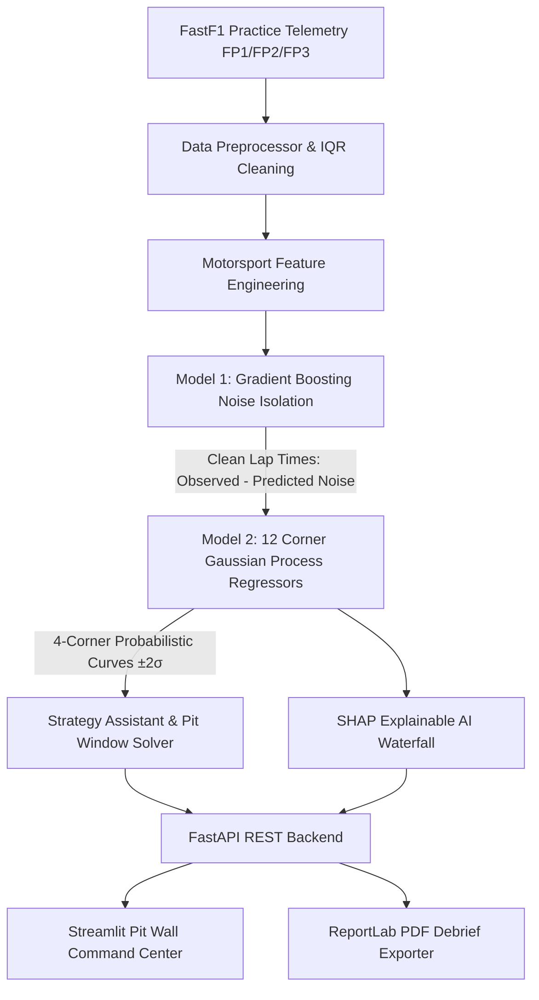

# TyreTwin — Formula 1 Tyre Degradation & Noise Isolation Intelligence Platform

[](https://www.python.org/downloads/)
[](https://fastapi.tiangolo.com)
[](https://streamlit.io)
[](https://www.docker.com)
[](https://opensource.org/licenses/MIT)

**TyreTwin** is an AI-powered Formula 1 pit wall telemetry intelligence platform designed to isolate **true tyre degradation** from noisy practice session telemetry (FP1, FP2, FP3) by decoupling external influences (fuel load burn, traffic wake, track evolution, weather, driver aggression) and forecasting 4-corner degradation curves with probabilistic $\pm 2\sigma$ Gaussian Process confidence intervals.

---

## The Motorsport Problem

In Formula 1 practice sessions, observed lap times do **not** directly reflect tyre wear due to compounding external noise factors:

$$\text{Observed Lap Time} = \text{True Tyre Performance} + \text{External Noise}$$

Where **External Noise** consists of:
- **Fuel Mass Burn**: Starting ~45-105kg ($10\text{ kg} \approx 0.30\text{s}$ lap penalty).
- **Track Grip Evolution**: Rubbering-in curve ($\frac{t}{T_{\text{total}}}$) recovering up to $0.45\text{s}$ over a session.
- **Traffic & Dirty Air**: Wake turbulence and micro-sector speed drops adding $+0.65\text{s}+$.
- **Driver Push Aggression**: Throttle & brake severity delta.
- **Thermal Conditions**: Track temperature offset from optimal tyre operating window.

---

## Machine Learning & Physics Architecture



### Stage 1: Noise Isolation Model (Gradient Boosting)
Predicts external non-tyre noise from physics-engineered features (fuel burn, track evolution index, traffic flag, push aggression index, thermal delta):

$$\widehat{\text{Noise}} = f_{\text{GBR}}(\text{Fuel}, \text{Evolution}, \text{Push}, \text{Traffic}, \text{Thermal})$$
$$\text{Clean Lap Time} = \text{Observed Lap Time} - \widehat{\text{Noise}}$$

### Stage 2: 4-Corner Probabilistic Degradation Model (Gaussian Process Regression)
Models tyre wear progression individually across all four wheel corners (FL, FR, RL, RR) using a Matérn kernel with uncertainty bounds:

$$k(x, x') = \sigma_0^2 \text{Matérn}_{5/2}(r) + \sigma_{\text{noise}}^2$$
$$\widehat{y}(\text{lap}) \sim \mathcal{N}\left(\mu(\text{lap}), \sigma^2(\text{lap})\right)$$

Yields smooth 4-corner degradation curves with shaded $\pm 2\sigma$ confidence bands (95% uncertainty envelope) for the critical limiting tyre.

---

## Repository Structure

```text
TyreTwin/
├── app/                                 # Streamlit Pit-Wall Frontend
│   ├── dashboard.py                     # Main Command Center Overview
│   ├── pages/
│   │   ├── 1_Degradation_Intelligence.py  # Gaussian Process Curves & SHAP
│   │   ├── 2_Telemetry_Explorer.py        # Synchronized 100Hz Multi-Sensor Trace
│   │   ├── 3_Strategy_Assistant.py         # Pit Window Solver & Crossover Deltas
│   │   ├── 4_Race_Validation.py            # Post-Race Model Accuracy Benchmarking
│   │   ├── 5_Engineering_Report.py         # 4-Phase Physical Decomposition & PDF Export
│   │   └── 6_Live_Stint_Replay.py          # Turn-by-Turn Telemetry Playback
│   ├── components/                      # CarSchematic, MetricCard, ConfidenceGauge, Selectors
│   ├── charts/                          # 4-Wheel, Noise Removal & Plotly visualizers
│   └── utils/                           # F1 Dark Theme CSS, REST API Client, PDF Generator
│
├── backend/                             # FastAPI Backend Microservice
│   ├── main.py                          # Application entrypoint & CORS middleware
│   ├── config.py                        # Pydantic settings & environment configuration
│   ├── api/endpoints/                   # /sessions, /predict, /strategy, /validate, /telemetry, /explain, /report
│   ├── database/                        # Normalized SQLAlchemy models & SQLite/Postgres auto-fallback
│   ├── schemas/                         # Pydantic v2 schemas
│   └── services/                        # Strategy, Data, and ML orchestrators
│
├── ml/                                  # Motorsport ML Pipeline
│   ├── fastf1_loader.py                 # FastF1 ingestion & cached benchmark telemetry
│   ├── preprocessing.py                 # In/Out lap filtering & IQR outlier removal
│   ├── feature_engineering.py           # Fuel burn, track evolution, traffic detection, push aggression
│   ├── four_wheel_model.py              # Dynamic load transfer & Pacejka friction work
│   ├── train_noise.py                   # Model 1: Gradient Boosting Noise Isolation
│   ├── train_degradation.py             # Model 2: 12 GP Corner Regressors with Matérn Kernel
│   ├── train_all.py                     # Automated training pipeline across all sessions
│   ├── predict.py                       # Unified prediction inference engine
│   ├── validation.py                    # Evaluation metrics (MAE, RMSE, R²)
│   └── explainability.py                # SHAP-style waterfall attribution
│
├── docker/                              # Multi-stage Dockerfiles (Backend & Frontend)
├── tests/                               # 100% passing Pytest suite (13/13 tests)
├── docker-compose.yml                   # Containerized stack orchestration
├── requirements.txt                     # Pinned dependencies
├── run.py                               # Single-command concurrent launcher
└── README.md                            # Complete engineering documentation
```

---

## Quickstart Guide

### Option 1: Single-Command Native Launch (Recommended)

1. Clone or navigate to the repository:
   ```bash
   cd TyreTwin
   ```

2. Install dependencies:
   ```bash
   pip install -r requirements.txt
   ```

3. Launch both FastAPI Backend and Streamlit Dashboard concurrently:
   ```bash
   python run.py
   ```

4. Access the platforms:
   - **Streamlit Pit Wall Dashboard**: [http://localhost:8501](http://localhost:8501)
   - **FastAPI Interactive API Docs**: [http://localhost:8000/docs](http://localhost:8000/docs)

---

### Option 2: Docker Compose Deployment

Launch the complete microservice architecture (PostgreSQL database, FastAPI backend, Streamlit frontend):

```bash
docker compose up --build
```

---

## API Endpoints Reference

| Method | Endpoint | Description |
|---|---|---|
| `POST` | `/api/sessions/load` | Ingests and synchronizes FastF1 session telemetry with DB caching. |
| `GET` | `/api/sessions/list` | Returns list of available cached race sessions. |
| `GET` | `/api/sessions/drivers` | Returns metadata for 2024 drivers and teams. |
| `POST` | `/api/predict` | Computes decoupled clean lap times, 4-corner GP degradation curves, and $\pm 2\sigma$ bounds. |
| `POST` | `/api/strategy` | Recommends optimal pit stop laps, stint lengths, and crossover points. |
| `POST` | `/api/validate` | Benchmarks model predictions against actual stint pace ($MAE, RMSE, R^2$). |
| `GET` | `/api/telemetry` | Retrieves 100Hz synchronized traces (Speed, Throttle, Brake, RPM, Gear, DRS). |
| `POST` | `/api/explain` | Generates SHAP-style feature attribution for lap time noise factors. |
| `POST` | `/api/report/generate` | Compiles official Pit Wall 4-tyre PDF debrief sheet using ReportLab. |
| `GET` | `/api/health` | Health check probe. |

---

## Automated Testing

Execute the test suite with pytest:

```bash
pytest tests/ -v
```

---

## Tech Stack

- **Frontend**: Streamlit, Plotly, Custom F1 Pit-Wall Dark CSS.
- **Backend**: FastAPI, Uvicorn, Pydantic v2, SQLAlchemy.
- **ML & Telemetry**: FastF1, XGBoost, Scikit-learn (GaussianProcessRegressor), SHAP, Pandas, NumPy.
- **Reporting**: ReportLab PDF Engine.
- **Deployment**: Docker & Docker Compose.
